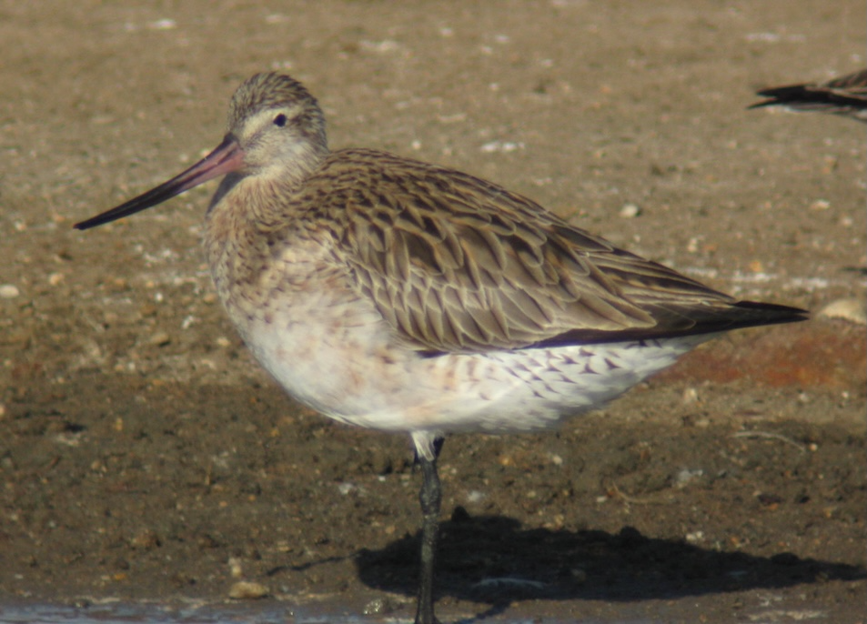

```{=html}
<div id="image-rotator" style="text-align: center;">
  
  <p id="error-message" style="color: red;"></p>
</div>

<script>
// Try both .png and .jpg extensions
const images = [
  'images/IMG_1352.png', 
  'images/IMG_6292.jpg',  // Changed to .jpg
  'images/IMG_7683.jpg'   // Changed to .jpg
];
let currentIndex = 0;
const imgElement = document.getElementById('rotating-image');
const errorMsg = document.getElementById('error-message');

imgElement.onerror = function() {
  errorMsg.textContent = 'Failed to load: ' + this.src;
};

imgElement.onload = function() {
  errorMsg.textContent = '';
};

setInterval(() => {
  currentIndex = (currentIndex + 1) % images.length;
  imgElement.src = images[currentIndex];
}, 20000);
</script>
```

**WADERS** or shorebirds are a diverse group of wading birds that comprise 10% of Australia’s bird species.  Most migrate to the northern hemisphere to breed.  During these remarkable long-distance seasonal marathons to and from their Arctic breeding grounds they face numerous threats to their survival.

The Queensland Wader Study Group (QWSG) was established in 1992 as a special interest group within Birds Queensland, to monitor wader populations in Queensland and to work towards their conservation.

The aim of this website is to share information about waders and QWSG’s activities with everyone interested in these special birds and to encourage participation in the conservation effort.